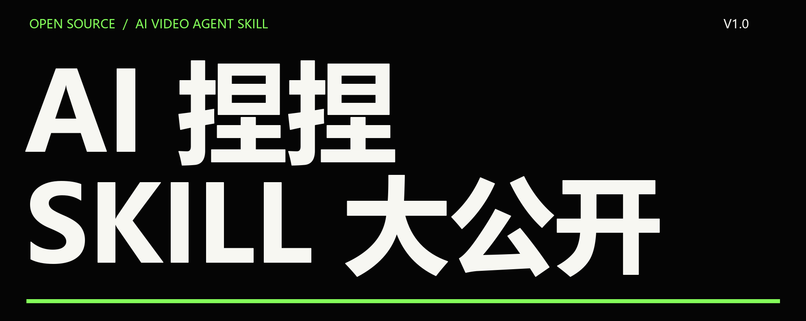
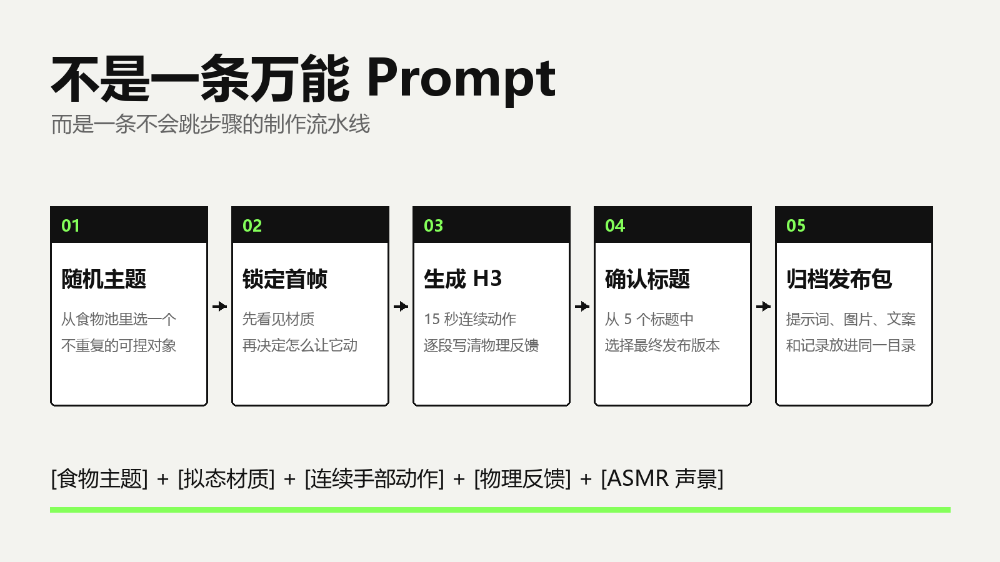
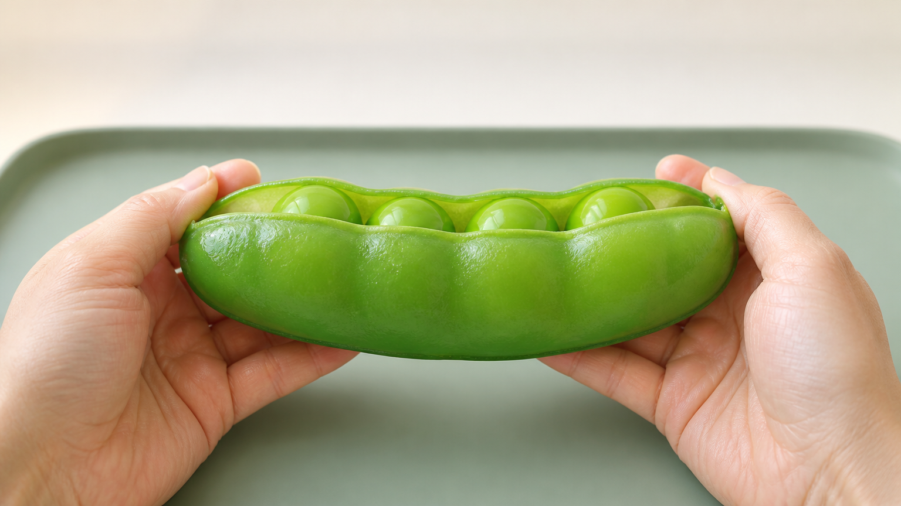
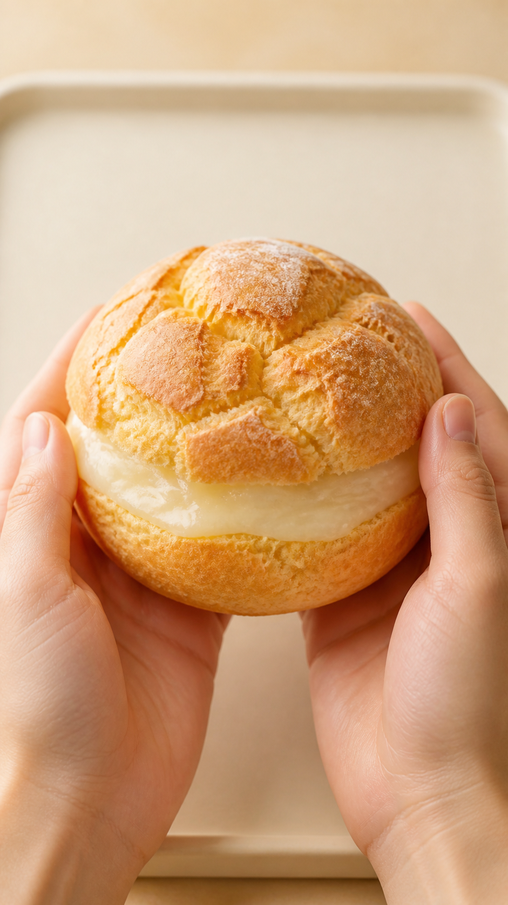

# 从此以后，你也可以一键做 AI 捏捏视频

这段时间一直有人问我：

那些看起来软软的、糯糯的，一捏就让人莫名解压的 AI 视频，到底是怎么做出来的？

今天不藏了。

我把自己一直在用的 **AI 捏捏视频 Skill** 整理了一遍，补上了第一次使用配置、完整提示词模板、确认流程和自动归档，现在正式开源。

而且这次不只把文件扔出来。

我也想把它背后的方法讲清楚。

## 先说最核心的工作流

如果把一条 AI 捏捏视频压缩成一句公式，大概就是：

**[食物主题] + [拟态材质] + [连续手部动作] + [物理反馈] + [ASMR 声景]**

就这？

对，就这。

但真正麻烦的地方，从来不是写出“捏一下草莓”“拉开一块面包”这种句子。

而是让首帧、动作、材质和声音，始终发生在同一个世界里。

首帧看起来像果冻，后面就不能突然碎成饼干。

画面里只有两只手，视频中途就不能凭空多出第三只。

前一秒刚把外皮剥开，后一秒也不能让它毫无理由恢复原状。

**AI 视频最容易露馅的，不是它不够漂亮，而是它忘了上一秒发生过什么。**



## 所以我没有做“万能 Prompt”

我做的是一条带硬闸门的流水线。

先选题。

再生成首帧。

首帧确认后，才根据画面里真实出现的食物、手势、托盘、光线和材质去写 15 秒动作。

H3 提示词确认后，再做标题和发布文案。

任何一步不满意，就只重做当前这一步。

旧版本不会被覆盖，后面的步骤也不会抢跑。

这件事看起来有点“笨”。

但 Agent 工作流里，笨一点往往更稳定。

## Skill 到底替我做了什么

它里面不是一条无限变长的 Prompt，而是几组相互咬合的规则：

- **主题池**：蔬菜、水果、面包、零食和甜点，每次随机抽 8 个，不重复。
- **首帧规则**：固定 9:16 微距构图，要求食物一眼可辨，同时给后续手部动作留出空间。
- **材质规则**：先从首帧判断外皮、内芯、黏性、弹性和延展性，再决定能不能剥、揉、拉、折。
- **动作链**：不是反复按压，而是塌陷、破裂、剥离、揉折、拉伸、回收、压合一路连续发生。
- **声景层**：每一个主要动作都有同步声音，细裂、黏连、气泡、拉丝和拍合各自有区别。
- **发布包**：图片、双语提示词、标题、文案、标签和制作记录统一归档。

**不是让 AI 多写一点，而是让它少忘一点。**

## 两种完全不同的材质

比如豌豆。

它适合做成半透明豆荚，外层柔韧，里面的豆粒有弹性，动作重点是撑开、滚动、挤压和黏性回弹。



换成泡芙，逻辑就不一样了。

外壳应该有轻微裂感，夹心则更湿润、更软糯。动作可以是压裂、剥开、挤出、折叠和重新揉合。



如果只用一条固定 Prompt，这两种东西最后很容易变成同一种塑料泥。

Skill 做的，就是保留共同骨架，同时让材质决定细节。

## 一个可以直接尝试的简化版

如果你暂时不想安装 Skill，也可以先拿这段思路去试：

```text
制作一条 15 秒、9:16、单镜头不切换的写实微距 ASMR 视频。

画面从已提供的食物拟态首帧开始。镜头和光线全程锁定，两只手按照“轻触确认材质 → 局部施压 → 外层塌陷或破裂 → 剥离 → 揉折 → 拉伸 → 回收压合”的顺序连续操作。

每个动作都要写清左右手的位置、材料的空间变化、可见物理反馈，以及与上一个动作的连续关系。材质必须遵守首帧事实，不凭空增加手、道具或新物体。

同步设计近距离双耳 ASMR 声景：皮肤摩擦、柔软闷压、细裂、湿润挤压、黏性剥离、拉丝、折叠拍合和最终厚实压合。无音乐、无旁白。
```

它能跑。

但你很快就会发现，真正费时间的，是每次都要重新检查比例、首帧、时间轴、动作连续性、声音和文件保存。

所以才有了 Skill 版。

## 开源版我又补了什么

这次公开的版本专门照顾了第一次使用的人。

第一次调用，它不会立刻开始生成。

它会先问你：文件想保存在哪里？

接着告诉你每次会创建怎样的目录、会交付哪些文件。等你明确确认后，才保存配置并进入原来的五阶段流程。

以后再次调用，它会读取你已经确认的目录，不需要每次重新配置。

配置文件留在你的用户目录里，仓库本身不写死任何人的电脑路径。

另外我把稳定的机械步骤做成了一个零依赖 Python 工具：随机选题、路径清洗、重名递增、运行记录初始化，都不再交给 Agent 临场发挥。

## GitHub

仓库地址：

**https://github.com/squashtrr-prog/ai-squish-video-skill**

一行安装：

```bash
npx skills add squashtrr-prog/ai-squish-video-skill
```

安装后，对 Agent 说：

```text
使用 ai-squish-video 帮我做一条 AI 捏捏视频。
```

就可以开始了。

## 最后

这套 Skill 不是为了把每个人的视频做成同一种样子。

恰恰相反。

主题池可以换，材质规则可以加，动作节奏也可以按你的账号风格继续改。

我更想开源的，其实不是几段提示词。

而是一个思路：

**把创作里容易遗忘的细节，变成 Agent 不允许跳过的步骤。**

如果它能帮你少返工一次，这次开源就值了。

— 铲屎官阿沐的AI日常
